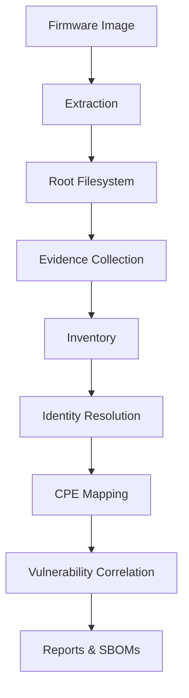

# Flens

**FLENS (Firmware Linux Embedded Security)** analyses embedded Linux firmware
without sending the image or its contents to an external service. It inventories
software, records how versions were identified, correlates the results with a
local vulnerability dataset, and produces HTML, [CycloneDX](https://cyclonedx.org/),
and [SPDX](https://spdx.dev/) reports.

> **Alpha status.** FLENS is an alpha-stage analysis tool, not a guarantee that firmware is
> secure. Zero matched vulnerabilities does not mean zero vulnerabilities.


## Features

- Offline firmware analysis
- Traceable component and version identification
- Conservative CPE (Common Platform Enumeration) mapping
- Offline [CVE](https://en.wikipedia.org/wiki/Common_Vulnerabilities_and_Exposures) correlation
- [CycloneDX](https://cyclonedx.org/) and [SPDX](https://spdx.dev/) SBOM generation
- HTML reporting
- Batch firmware scanning
- Docker and Docker Compose support

## Why FLENS

Firmware analysis rarely ends with unpacking an image. Package metadata may be
missing, binaries may report incomplete versions, and the name found in a
filesystem may not map cleanly to a CPE. FLENS keeps the observations behind
each identification in the result, and leaves an identity unresolved when the
available data is not strong enough.

The project is developed against real router and embedded-Linux images rather
than a synthetic happy path. The published validation corpus currently includes
15 images across MIPS and ARM targets: 11 produce reports and four document
extraction failures. Those failures are kept in the results because format
coverage is part of the problem, not something to hide from the benchmark.

## Where FLENS fits

It sits between firmware acquisition and manual reverse engineering:

```text
Vendor Firmware
        │
        ▼
Extraction
        │
        ▼
      FLENS
        │
        ├── Component inventory
        ├── Version evidence
        ├── Identity resolution
        ├── Governed CPE mapping
        ├── Offline vulnerability correlation
        ├── HTML report
        ├── CycloneDX SBOM
        └── SPDX SBOM
        │
        ▼
Security review / Compliance / Further reverse engineering
```
The output shows what software FLENS found, how it derived each version and
identity, which local vulnerability records matched, and which findings still
need manual investigation. Extraction, inventory, identity resolution, CPE
selection, vulnerability correlation, and report generation run as one
reproducible pipeline. Deeper reverse engineering remains a separate step.

## Current capabilities

- Linux firmware extraction and rootfs discovery
- Package, known-binary, and ELF executable and shared library analysis
- Deterministic inventory merge with version evidence
- Governed identity resolution and CPE selection
- Offline vulnerability correlation
- HTML, [CycloneDX](https://cyclonedx.org/), [SPDX](https://spdx.dev/) and batch-scan output
- ARM64 Docker and Docker Compose workflows

## Architecture




## Identity and CPE Mapping

Firmware often contains the same software under different names, incomplete
version information, or ambiguous identifiers.

FLENS combines evidence from packages, binaries, and shared libraries to
identify software components and map them to official CPEs (Common Platform
Enumeration identifiers).

Mappings are only made when supported by sufficient evidence. If confidence is
too low, FLENS reports the component as **Unknown** rather than making an
incorrect vulnerability match.

This conservative approach reduces false positives and makes every
vulnerability match traceable back to the evidence used to identify the
software.

## Validation

FLENS has been validated using an ARM64 Docker environment against a corpus of
15 embedded Linux firmware images.

Validation included:

- Firmware extraction
- Component inventory generation
- Identity resolution
- Governed CPE mapping
- Offline vulnerability correlation
- HTML report generation
- CycloneDX and SPDX SBOM generation
- Batch scanning with Docker Compose

Results:

- 15 firmware images analysed
- 11 firmware images successfully extracted and analysed
- 4 images that could not be fully analysed
- 96 automated tests passed (1 platform-specific skipped)
- Ruff and MyPy passed
- ARM64 Docker and Docker Compose validated

Detailed validation evidence is available in
[`docs/release-evidence`](docs/release-evidence/v0.3.0-alpha/).

> A result of zero matched vulnerabilities only describes the configured local
> dataset and the components FLENS could identify. It is not proof that the
> firmware is secure.


## Validated Firmware Reports

FLENS was evaluated on a representative corpus of embedded Linux firmware from
commercial vendors and open-source distributions.

| Validation Summary | |
|--------------------|--:|
| Firmware images tested | **15** |
| Successful analyses | **11** |
| Extraction failures | **4** |
| HTML reports generated | **11** |
| PDF reports published | **11** |
| Architectures | **MIPS, ARM** |

The reports below are the exact outputs generated by FLENS during validation.

> `0 matched CVEs` indicates that no vulnerabilities matched the configured
> local vulnerability dataset. It should not be interpreted as proof that the
> firmware is secure.


| Firmware | Result | Components | Analysis Report | Official Firmware Source |
|---|---|---:|---|---|
| TP-Link Archer C7 v5 | Succeeded - 0 matched CVEs | 387 | [PDF](docs/release-evidence/v0.3.0-alpha/reports/flens-archer-c7-v5-report.pdf) | [TP-Link Archer C7 v5 download page](https://www.tp-link.com/support/download/archer-c7/v5/) |
| 8devices Carambola 2 | Succeeded - 0 matched CVEs | 282 | [PDF](docs/release-evidence/v0.3.0-alpha/reports/flens-carambola2-report.pdf) |  |
| Netgear R6400v2 DD-WRT | Succeeded - 0 matched CVEs | 584 | [PDF](docs/release-evidence/v0.3.0-alpha/reports/flens-netgear-r6400v2-ddwrt-report.pdf) |  |
| Netgear R7000 DD-WRT | Succeeded - 0 matched CVEs | 572 | [PDF](docs/release-evidence/v0.3.0-alpha/reports/flens-netgear-r7000-ddwrt-report.pdf) |  |
| ALFA AP96 OpenWrt 19.07.10 | Succeeded - 0 matched CVEs | 224 | [PDF](docs/release-evidence/v0.3.0-alpha/reports/flens-openwrt-ap96-19.07.10-report.pdf) | [OpenWrt 19.07.10 release page](https://downloads.openwrt.org/releases/19.07.10/) |
| Meraki MR16 OpenWrt 19.07.10 | Succeeded - 0 matched CVEs | 212 | [PDF](docs/release-evidence/v0.3.0-alpha/reports/flens-openwrt-meraki-mr16-19.07.10-report.pdf) | [OpenWrt 19.07.10 release page](https://downloads.openwrt.org/releases/19.07.10/) |
| Onion Omega OpenWrt 19.07.10 | Succeeded - 0 matched CVEs | 238 | [PDF](docs/release-evidence/v0.3.0-alpha/reports/flens-openwrt-onion-omega-19.07.10-report.pdf) | [OpenWrt 19.07.10 release page](https://downloads.openwrt.org/releases/19.07.10/) |
| Packet Squirrel OpenWrt 19.07.10 | Succeeded - 0 matched CVEs | 212 | [PDF](docs/release-evidence/v0.3.0-alpha/reports/flens-openwrt-packet-squirrel-19.07.10-report.pdf) | [OpenWrt 19.07.10 release page](https://downloads.openwrt.org/releases/19.07.10/) |
| Linksys EA6500 DD-WRT | Succeeded - 0 matched CVEs | 616 | [PDF](docs/release-evidence/v0.3.0-alpha/reports/flens-linksys-ea6500-ddwrt-report.pdf) |  |
| ALFA AP96 sysupgrade OpenWrt 19.07.10 | Succeeded - 0 matched CVEs | 224 | [PDF](docs/release-evidence/v0.3.0-alpha/reports/flens-openwrt-ap96-sysupgrade-19.07.10-report.pdf) | [OpenWrt ar71xx/generic downloads](https://downloads.openwrt.org/releases/19.07.10/targets/ar71xx/generic/) |
| TP-Link TL-WA701ND v2 | Succeeded - 0 matched CVEs | 150 | [PDF](docs/release-evidence/v0.3.0-alpha/reports/flens-tplink-tl-wa701nd-v2-report.pdf) | [TP-Link TL-WA701ND v2 download page](https://www.tp-link.com/support/download/tl-wa701nd/v2/) |

### Extraction Failures

| Original input | Result |
|---|---|
| `DIR878A1_FW100B13.bin` | Extraction failed - no report generated |
| `firmware/sample_router.bin` | Extraction failed - no report generated |
| `linksys_ea6500_cfe.bin` | Extraction failed - no report generated |
| `uploads/router.bin` | Extraction failed - no report generated |

## Quick Start

FLENS requires Python 3.12 or later. `uv` is the recommended dependency and environment manager;
it is not part of FLENS at runtime. The FLENS CLI provides the `scan` and `firmware` commands.

### Option 1: Docker

Docker is the recommended firmware-extraction workflow on Windows. Extraction occurs in the Linux
`/work` volume; `sample_data` is read-only and final artefacts are written to the host `output/`
mount.

```bash
docker build --platform linux/arm64 -t flens:docker .
docker compose up --build --abort-on-container-exit
docker compose down
```

Compose batch-scans `sample_data/` into `output/sample-scans/`. Set `FLENS_INPUT_DIR` or
`FLENS_OUTPUT_DIR` to use different host directories. `docker compose down -v` also removes the
named Linux workspace volume.

### Option 2: Run from source with uv

From the repository root, create the managed environment and invoke the local CLI:

```bash
uv sync
uv run flens --help
```

`uv sync` installs the local `flens` entry point into uv's managed environment. There is no
`python -m flens` entry point; the equivalent module invocation is
`uv run python -m app.presentation.cli.main`.

### Option 3: Install the CLI

Install the local checkout as an editable uv tool to make `flens` available as a direct command:

```bash
uv tool install --editable .
flens --help
```

The editable installation keeps FLENS' report template available from the checkout. `uv run flens
...` runs the project entry point inside uv's managed environment. `flens ...` runs the command
installed by `uv tool install --editable .`; ensure uv's tool bin directory is on `PATH` (or run
`uv tool update-shell` once). A non-editable `uv tool install .` does not currently package the
HTML template, so use the editable installation or Docker for report generation.

## CLI Usage

`scan` analyses an already extracted Linux root filesystem. `firmware` extracts and then analyses
a `.bin`, `.img`, or `.trx` firmware image; it needs Binwalk and SquashFS tools, so Docker is the
recommended option when those tools are unavailable locally.

The examples below use the tested source-mode invocation. After installing the CLI, replace
`uv run flens` with `flens`.

### Analyse an extracted root filesystem

```bash
uv run flens scan sample_data/rootfs \
  --report-out output/rootfs-report.html \
  --sbom-out output/rootfs-sbom
```

### Analyse a firmware image

```bash
uv run flens firmware firmware.bin \
  --report-out output/report.html \
  --sbom-out output/sbom
```

### Batch scanning

```bash
uv run python scripts/scan_sample_firmware.py \
  --input-dir sample_data \
  --output-dir output/sample-scans \
  --work-dir work \
  --overwrite
```

For each successful image, the batch runner creates a collision-safe output directory containing
- `report.html`
- `cyclonedx.json`
- `spdx.json`
- `scan-summary.json`

 It also writes

- `batch-summary.json`
- `batch-summary.csv`
 
 And a batch README in the selected output directory.

The `--work-dir` option is useful for a Linux-local extraction workspace; Docker Compose supplies
`/work` automatically.

## Development

Install development dependencies, then run the quality checks from the repository root:

```bash
uv sync --extra dev
uv run pytest
uv run ruff check .
uv run mypy app scripts
```


## Limitations

Firmware format coverage, version evidence, governed CPE coverage, and local vulnerability data are
incomplete. Encrypted/proprietary firmware and bootloader-only images may not yield a rootfs. FLENS
does not provide regulatory-compliance guarantees.

## Roadmap

FLENS is moving from a single scan pipeline toward a traceable firmware analysis
system. The goal is to preserve raw observations, explain how each conclusion
was reached, and keep results reproducible as tools and vulnerability data change.

1. **Domain foundation:** model analysis projects, firmware artifacts, tool runs,
   and provenance with stable identifiers and deterministic serialization.
2. **Analysis model:** separate observations from component identities, findings,
   and review decisions so conflicting or uncertain data is not discarded.
3. **Collector migration:** move package, binary, and ELF analysis onto the new
   model while preserving current CLI commands, reports, and SBOM output.
4. **Interoperability:** add a versioned analysis export, updateable vulnerability
   data, firmware-release comparison, and OpenVEX output.

The [migration plan](docs/architecture/migration-plan.md) contains the detailed
sequence, compatibility requirements, and suggested contribution boundaries.

## Quality

Release-preparation validation recorded 96 passing tests and one platform-specific skip, plus 44
focused tests; Ruff, MyPy, ARM64 Docker, Compose, and a 15-image batch were validated.

## Contributing and security

See [CONTRIBUTING.md](CONTRIBUTING.md) and [SECURITY.md](SECURITY.md). Evidence is required for
new version detection, identity aliases, CPE mappings, and vulnerability matches.


## Licence

FLENS is licensed under [Apache-2.0](LICENSE). Firmware samples are governed separately by
[firmware provenance](docs/firmware-provenance.md); users should provide their own legally obtained
firmware where redistribution is not documented.
