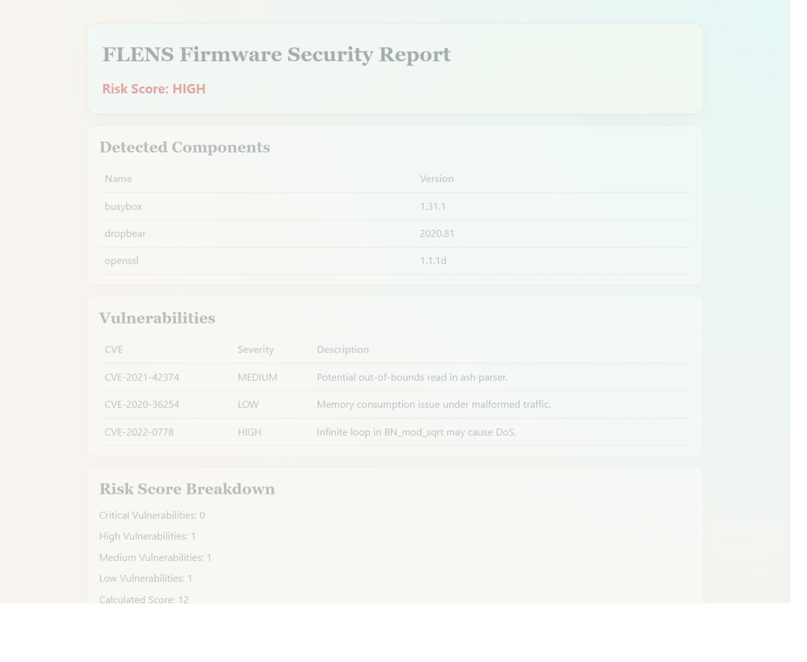
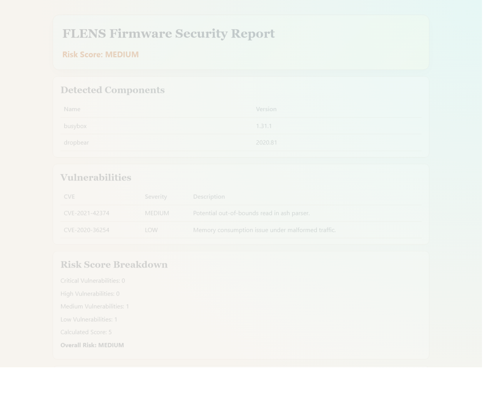

# FLENS


Flens can analyze embedded Linux firmware, identify software components, map known vulnerabilities, and generate actionable security reports.

FLENS is a Python-based CLI firmware security analysis tool designed for embedded Linux systems such as routers, IoT gateways, industrial controllers, cameras, and edge devices.

The project aims to bring firmware security closer to embedded software development by combining component discovery, vulnerability identification, risk assessment, and reporting into an extensible engineering workflow.

---

## Why FLENS?


Firmware often contains hundreds of third-party components:

* OpenSSL
* BusyBox
* Dropbear
* Curl
* Nginx
* Linux Kernel packages

Many products ship with outdated or vulnerable versions of these components, creating hidden security risks.

FLENS helps answer questions like:

* What software exists inside this firmware?
* Which versions are present?
* Are any known vulnerabilities affecting them?
* What is the overall risk profile?
* How does one firmware release compare to another?

## Where FLENS Fits

Existing firmware analysis tools are excellent at extracting and inspecting firmware images. However, embedded teams often need more than a one-time security scan.

FLENS focuses on the engineering workflow:

- Integrating firmware security checks into development pipelines
- Tracking component risks across firmware releases
- Generating actionable reports for developers and reviewers
- Providing an extensible foundation for SBOM, vulnerability management, and CI/CD security gates

Instead of treating firmware analysis as a manual security exercise, FLENS aims to make it part of the embedded software lifecycle.

Example workflow:

```
Yocto Build / Firmware Release
│
▼
FLENS Analysis
│
▼
Components + CVEs + Risk Score
│
▼
Security Report / Release Decision

```

FLENS bridges the gap between **firmware reverse engineering tools** and **everyday embedded software engineering workflows**.

---

## Current Capabilities

### Component Discovery

Automatically identifies known software components inside an extracted firmware filesystem.

Example:

```text
OpenSSL 1.1.1d
BusyBox 1.31.1
Dropbear 2020.79
```

### Vulnerability Mapping

Correlates detected software versions against a vulnerability database.

Example:

```text
OpenSSL 1.1.1d

→ CVE-2022-0778
→ CVE-2021-3711
```

### Risk Assessment

Calculates an overall firmware security score using configurable severity weighting.

Example:

```text
Risk Level: HIGH
```

### Report Generation

Produces human-readable HTML reports suitable for audits, reviews, and release validation.

Reports include:

* Risk score breakdown
* Vulnerability detection explanation
* Transparency & methodology references
* Security disclaimer

### SBOM Generation

Generates machine-readable SBOMs in both CycloneDX JSON and SPDX JSON formats for each scan.

### Persistent Scan History

Stores scan artifacts in SQLite for report retrieval and auditability:

* Components
* Vulnerabilities
* Risk score
* SBOM payloads
* Firmware metadata

### Firmware Metadata + ELF Intelligence

Enhances detection with:

* ELF architecture parsing
* Binary string fingerprints for component identification fallback
* Firmware kernel and vendor hints from extracted rootfs

---

## Example Scan

Input:

```text
rootfs/
├── bin/
│   ├── busybox
│   ├── openssl
│   └── dropbear
```

Output:

```text
──────────────────────────
FLENS Security Report
──────────────────────────

Detected Components

• BusyBox 1.31.1
• OpenSSL 1.1.1d
• Dropbear 2020.79

Detected Vulnerabilities

• CVE-2022-0778 (HIGH)
• CVE-2021-3711 (HIGH)

Overall Risk

HIGH
```

---

## Architecture

FLENS follows Clean Architecture principles to separate business logic from implementation details.

```text
Root Filesystem
        │
        ▼
Component Detection
        │
        ▼
Version Resolution
        │
        ▼
Vulnerability Mapping
        │
        ▼
Risk Assessment
        │
        ▼
HTML Report / API Response
```

Project Structure:

```text
flens/
├── app/
│   ├── domain/
│   ├── application/
│   ├── infrastructure/
│   ├── presentation/
│   └── config/
├── tests/
├── sample_data/
├── docs/
└── pyproject.toml
```

---

## Prerequisites

Before running FLENS, make sure the following are in place:

* Python 3.12+
* The same virtual environment is used for install and runtime
* Python dependencies installed with `pip install -e .[dev]`
* For firmware image analysis, native extraction tools installed in the same shell/environment:
        * `binwalk`
        * `squashfs-tools`

If you run `flens` from a different Python environment than the one used for installation, you can get missing-module errors or incomplete analysis. For firmware reports, that can also lead to misleading output, so it is better to stop and fix the environment first.

Recommended Windows workflow:

```powershell
.\.venv\Scripts\Activate.ps1
pip install -e .[dev]
```

## Quick Start

### Choose the Right Command

| Input you have | Command to use | When Docker is useful |
| --- | --- | --- |
| An extracted firmware directory, such as `squashfs-root/` | `flens scan <rootfs-path>` | Optional; Python dependencies are sufficient. |
| A firmware image, such as `.bin`, `.img`, or `.trx` | `flens firmware <firmware-path>` | Recommended on Windows or when `binwalk` and `squashfs-tools` are not installed locally. |

`flens scan` does not extract firmware. Passing a `.bin` file to it will not find components because it expects a directory of extracted files. Use `flens firmware` for the image first.

Navigate the CLI with:

```powershell
flens --help
flens scan --help
flens firmware --help
```

Install:

```bash
pip install -e .[dev]
```

Run a scan:

```bash
flens scan sample_data/rootfs
```

Generate an HTML report:

```bash
flens scan sample_data/rootfs \
    --report-out report.html
```

Generate SBOM exports (SPDX + CycloneDX):

```bash
flens scan sample_data/rootfs \
        --report-out output/report.html \
        --sbom-out output
```

## Example Reports

| Rootfs fixture | OpenWrt firmware image |
| --- | --- |
|  |  |

The rootfs fixture is deliberately small and deterministic: it contains placeholder binaries for BusyBox, Dropbear, and OpenSSL. It is useful for quick CLI and report tests.

The OpenWrt example is produced by extracting a real `squashfs-sysupgrade.bin` firmware image. It demonstrates the complete extraction-to-report workflow. Current component versions and CVE matches come from FLENS's bundled static test dataset, so treat the findings as pipeline examples rather than a production vulnerability assessment.

Analyze a firmware image directly:

```bash
flens firmware sample_data/firmware/sample_router.bin --report-out firmware_report.html
```

Analyze firmware image and export SBOMs:

```bash
flens firmware sample_data/firmware/sample_router.bin \
        --report-out output/report.html \
        --sbom-out output
```

Generated files:

```text
output/
├── report.html
├── report.spdx.json
└── report.cyclonedx.json
```

Optional: set FLENS_REPOSITORY_URL to render clickable methodology links in HTML reports.

Example:

```bash
set FLENS_REPOSITORY_URL=https://github.com/example/flens
```

---

## API

Run locally:

```bash
uvicorn app.presentation.api.main:api --reload
```

Open:

```text
http://localhost:8000/docs
```

Available endpoints:

```http
GET  /health
POST /scan
POST /firmware/upload
GET  /reports/{report_id}
```

Example scan request:

```json
{
        "rootfs_path": "sample_data/rootfs"
}
```

Example scan response (persisted):

```json
{
        "components": [
                {"name": "openssl", "version": "1.1.1d"}
        ],
        "vulnerabilities": [
                {
                        "cve_id": "CVE-2022-0778",
                        "severity": "HIGH",
                        "description": "Infinite loop in BN_mod_sqrt"
                }
        ],
        "risk_score": "HIGH",
        "report_id": 1
}
```

---

## Quality Standards

FLENS includes:

* Type hints
* Dependency injection
* Unit tests
* Integration tests
* Static analysis
* HTML reporting
* CI-ready structure

Validation:

```bash
ruff check .
mypy .
pytest -v
pytest --cov
```

---

## Roadmap

### Phase 1 - Foundation ✅

* Component detection
* Version resolution
* CVE matching
* Risk scoring
* CLI interface
* HTML reporting

### Phase 2 - Firmware Extraction

```text
firmware.bin
      │
      ▼
    Binwalk
      ▼
    rootfs
```

* Direct firmware analysis
* Filesystem extraction
* Metadata discovery

### Phase 3 - SBOM Generation

* SPDX + CycloneDX generation
* SQLite persistence for reports
* ELF-assisted component identification
* Firmware metadata extraction
* Expanded API for upload and report retrieval

### Phase 4 - Secret Discovery

Detect:

* Private keys
* API keys
* Credentials
* Certificates

### Phase 5 - Firmware Diffing

Compare releases:

```text
Firmware A
     vs
Firmware B
```

Identify:

* Added packages
* Removed packages
* New vulnerabilities
* Fixed vulnerabilities

### Phase 6 - Security Platform

* Scan history
* Dashboard
* Multi-user support
* Automated analysis pipelines

---

## Technology Stack

* Python 3.12+
* FastAPI
* Pydantic
* Typer
* Jinja2
* Pytest
* Ruff
* MyPy

---

## Motivation

FLENS is designed for engineers building embedded Linux products who need visibility into the security posture of their firmware before deployment.

FLENS was created to explore the intersection of:

* Embedded Linux
* Firmware Analysis
* Software Supply Chain Security
* Vulnerability Management
* Modern Python Architecture

The long-term vision is to evolve FLENS into a comprehensive firmware security platform capable of analyzing, comparing, and monitoring embedded software releases at scale.

---

## Methodology Documentation

See:

* docs/risk_scoring.md
* docs/vulnerability_detection.md
* docs/sbom.md

