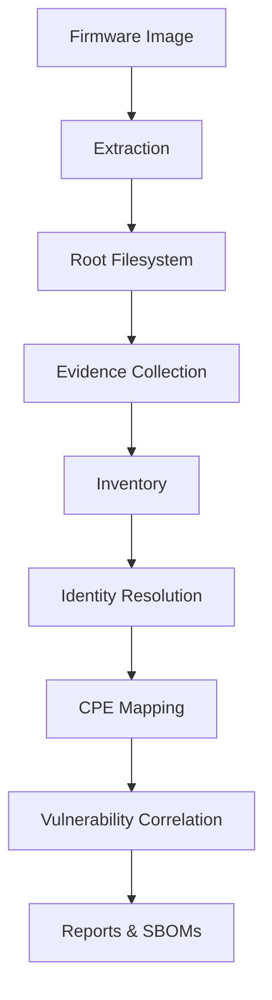

# FLENS

**FLENS (Firmware Linux Embedded Security)** is an offline-first firmware analysis
platform for embedded Linux images. It helps engineers understand what software
is inside a firmware image, which versions can be identified, which known
vulnerabilities may apply, and produces HTML, [CycloneDX](https://cyclonedx.org/), and [SPDX](https://spdx.dev/) reports.

> **Alpha status.** FLENS is an alpha-stage analysis tool, not a guarantee that firmware is
> secure. Zero matched vulnerabilities does not mean zero vulnerabilities.


## Features

- Offline firmware analysis
- Evidence-backed component identification
- Conservative CPE mapping
- Offline CVE correlation
- [CycloneDX](https://cyclonedx.org/) and [SPDX](https://spdx.dev/) SBOM generation
- HTML reporting
- Batch firmware scanning
- Docker and Docker Compose support

## Why FLENS

Embedded firmware is difficult to inspect reproducibly: extraction varies by format, component
names are ambiguous, CPE mapping needs governance, and SBOM/vulnerability output needs evidence
and limitations. FLENS makes these decisions visible rather than silently guessing.

FLENS is intended for:

- Embedded Linux engineers
- Firmware security researchers
- Product security teams
- SBOM generation
- Vulnerability assessment
- Supply-chain analysis

## Where FLENS fits

FLENS is intended for firmware security researchers, embedded Linux engineers,
SBOM generation, and vulnerability assessment workflows.

It sits between firmware acquisition and manual reverse engineering:

```text
Vendor Firmware
        │
        ▼
Extraction
        │
        ▼
      FLENS
        │
        ├── Component inventory
        ├── Version evidence
        ├── Identity resolution
        ├── Governed CPE mapping
        ├── Offline vulnerability correlation
        ├── HTML report
        ├── CycloneDX SBOM
        └── SPDX SBOM
        │
        ▼
Security review / Compliance / Further reverse engineering
```
### FLENS is designed to answer:

- What software is inside this firmware?
- Which component versions can be supported by evidence?
- Which identities can safely map to a CPE?
- Which known vulnerabilities match that evidence?
- What remains unknown and requires manual investigation?

It is not a firmware extractor, vulnerability scanner or reverse-engineering
framework alone. It provides a reproducible analysis pipeline that connects these
steps into a single evidence-driven workflow.

## Current capabilities

- Linux firmware extraction and rootfs discovery
- Package, known-binary, and ELF executable and shared library analysis
- Deterministic inventory merge with version evidence
- Governed identity resolution and CPE selection
- Offline vulnerability correlation
- HTML, [CycloneDX](https://cyclonedx.org/), [SPDX](https://spdx.dev/) and batch-scan output
- ARM64 Docker and Docker Compose workflows

## Architecture




## Identity and CPE Mapping

Firmware often contains the same software under different names, incomplete
version information, or ambiguous identifiers.

FLENS combines evidence from packages, binaries, and shared libraries to
identify software components and map them to official CPEs (Common Platform
Enumeration identifiers).

Mappings are only made when supported by sufficient evidence. If confidence is
too low, FLENS reports the component as **Unknown** rather than making an
incorrect vulnerability match.

This conservative approach reduces false positives and makes every
vulnerability match traceable back to the evidence used to identify the
software.

## Validation

FLENS has been validated using an ARM64 Docker environment against a corpus of
15 embedded Linux firmware images.

Validation included:

- Firmware extraction
- Component inventory generation
- Identity resolution
- Governed CPE mapping
- Offline vulnerability correlation
- HTML report generation
- CycloneDX and SPDX SBOM generation
- Batch scanning with Docker Compose

Results:

- 15 firmware images analysed
- 11 firmware images successfully extracted and analysed
- 4 images that could not be fully analysed
- 96 automated tests passed (1 platform-specific skipped)
- Ruff and MyPy passed
- ARM64 Docker and Docker Compose validated

Detailed validation evidence is available in
[`docs/release-evidence`](docs/release-evidence/v0.3.0-alpha/).

> FLENS is an evidence-driven analysis tool. Zero matched vulnerabilities does
> **not** imply that firmware is secure or free from vulnerabilities.


## Validated Firmware Reports

FLENS was evaluated on a representative corpus of embedded Linux firmware from
commercial vendors and open-source distributions.

| Validation Summary | |
|--------------------|--:|
| Firmware images tested | **15** |
| Successful analyses | **11** |
| Extraction failures | **4** |
| HTML reports generated | **11** |
| PDF reports published | **11** |
| Architectures | **MIPS, ARM** |

The reports below are the exact outputs generated by FLENS during validation.

> `0 matched CVEs` indicates that no vulnerabilities matched the configured
> local vulnerability dataset. It should not be interpreted as proof that the
> firmware is secure.


| Firmware | Result | Components | Analysis Report | Official Firmware Source |
|---|---|---:|---|---|
| TP-Link Archer C7 v5 | Succeeded - 0 matched CVEs | 387 | [PDF](docs/release-evidence/v0.3.0-alpha/reports/flens-archer-c7-v5-report.pdf) | [TP-Link Archer C7 v5 download page](https://www.tp-link.com/support/download/archer-c7/v5/) |
| 8devices Carambola 2 | Succeeded - 0 matched CVEs | 282 | [PDF](docs/release-evidence/v0.3.0-alpha/reports/flens-carambola2-report.pdf) | Source not recorded for the exact image |
| Netgear R6400v2 DD-WRT | Succeeded - 0 matched CVEs | 584 | [PDF](docs/release-evidence/v0.3.0-alpha/reports/flens-netgear-r6400v2-ddwrt-report.pdf) | Source not recorded for the exact image |
| Netgear R7000 DD-WRT | Succeeded - 0 matched CVEs | 572 | [PDF](docs/release-evidence/v0.3.0-alpha/reports/flens-netgear-r7000-ddwrt-report.pdf) | Source not recorded for the exact image |
| ALFA AP96 OpenWrt 19.07.10 | Succeeded - 0 matched CVEs | 224 | [PDF](docs/release-evidence/v0.3.0-alpha/reports/flens-openwrt-ap96-19.07.10-report.pdf) | [OpenWrt 19.07.10 release page](https://downloads.openwrt.org/releases/19.07.10/) |
| Meraki MR16 OpenWrt 19.07.10 | Succeeded - 0 matched CVEs | 212 | [PDF](docs/release-evidence/v0.3.0-alpha/reports/flens-openwrt-meraki-mr16-19.07.10-report.pdf) | [OpenWrt 19.07.10 release page](https://downloads.openwrt.org/releases/19.07.10/) |
| Onion Omega OpenWrt 19.07.10 | Succeeded - 0 matched CVEs | 238 | [PDF](docs/release-evidence/v0.3.0-alpha/reports/flens-openwrt-onion-omega-19.07.10-report.pdf) | [OpenWrt 19.07.10 release page](https://downloads.openwrt.org/releases/19.07.10/) |
| Packet Squirrel OpenWrt 19.07.10 | Succeeded - 0 matched CVEs | 212 | [PDF](docs/release-evidence/v0.3.0-alpha/reports/flens-openwrt-packet-squirrel-19.07.10-report.pdf) | [OpenWrt 19.07.10 release page](https://downloads.openwrt.org/releases/19.07.10/) |
| Linksys EA6500 DD-WRT | Succeeded - 0 matched CVEs | 616 | [PDF](docs/release-evidence/v0.3.0-alpha/reports/flens-linksys-ea6500-ddwrt-report.pdf) | Source not recorded for the exact image |
| ALFA AP96 sysupgrade OpenWrt 19.07.10 | Succeeded - 0 matched CVEs | 224 | [PDF](docs/release-evidence/v0.3.0-alpha/reports/flens-openwrt-ap96-sysupgrade-19.07.10-report.pdf) | [OpenWrt ar71xx/generic downloads](https://downloads.openwrt.org/releases/19.07.10/targets/ar71xx/generic/) |
| TP-Link TL-WA701ND v2 | Succeeded - 0 matched CVEs | 150 | [PDF](docs/release-evidence/v0.3.0-alpha/reports/flens-tplink-tl-wa701nd-v2-report.pdf) | [TP-Link TL-WA701ND v2 download page](https://www.tp-link.com/support/download/tl-wa701nd/v2/) |

### Extraction Failures

| Original input | Result |
|---|---|
| `DIR878A1_FW100B13.bin` | Extraction failed - no report generated |
| `firmware/sample_router.bin` | Extraction failed - no report generated |
| `linksys_ea6500_cfe.bin` | Extraction failed - no report generated |
| `uploads/router.bin` | Extraction failed - no report generated |
## Quick start: Docker

Docker is the recommended extraction path on Windows. Extraction occurs in the Linux `/work`
volume; `sample_data` is read-only and final artefacts are written to the host `output/` mount.

```powershell
docker build --platform linux/arm64 -t flens:docker .
docker compose up --build --abort-on-container-exit
docker compose down
```

The Compose defaults scan `/workspace/sample_data` into `/workspace/output/sample-scans`.
Override them with `FLENS_INPUT_DIR` and `FLENS_OUTPUT_DIR`. `docker compose down -v` also removes
the named Linux workspace volume.

## Local development

Python 3.12+ is required.

```powershell
uv sync
uv run pytest
uv run ruff check .
uv run mypy app scripts
```

## CLI and batch scanning

```powershell
flens scan sample_data/rootfs --report-out output/rootfs-report.html --sbom-out output
flens firmware firmware.bin --report-out output/report.html --sbom-out output
python scripts/scan_sample_firmware.py --input-dir sample_data --output-dir output/sample-scans --work-dir work --overwrite
```

The batch runner writes `batch-summary.json`, `batch-summary.csv`, a batch README, and one
collision-safe directory per successful firmware containing `report.html`, `cyclonedx.json`,
`spdx.json`, and `scan-summary.json`.


## Limitations

Firmware format coverage, version evidence, governed CPE coverage, and local vulnerability data are
incomplete. Encrypted/proprietary firmware and bootloader-only images may not yield a rootfs. FLENS
does not provide regulatory-compliance guarantees.

## Roadmap

Planned improvements include:

- Improved version extraction
- Additional filesystem support
- Expanded CPE coverage
- Live CVE database updates
- Richer HTML reports
- Performance improvements

## Quality

Release-preparation validation recorded 96 passing tests and one platform-specific skip, plus 44
focused tests; Ruff, MyPy, ARM64 Docker, Compose, and a 15-image batch were validated.

## Contributing and security

See [CONTRIBUTING.md](CONTRIBUTING.md) and [SECURITY.md](SECURITY.md). Evidence is required for
new version detection, identity aliases, CPE mappings, and vulnerability matches.


## Licence

FLENS is licensed under [Apache-2.0](LICENSE). Firmware samples are governed separately by
[firmware provenance](docs/firmware-provenance.md); users should provide their own legally obtained
firmware where redistribution is not documented.
