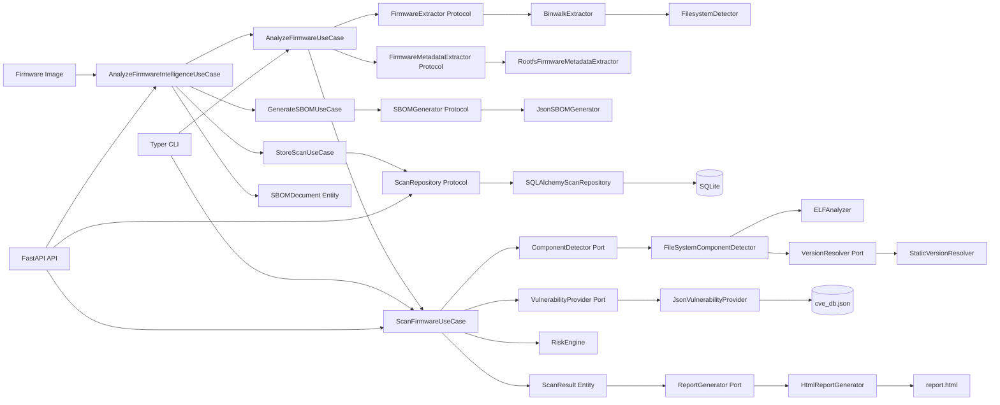

# FLENS Architecture (Phase 3)



## Principles Applied

- Dependency inversion: use case depends on ports, not adapters.
- Immutable domain entities: frozen dataclasses with stable value semantics.
- Swappable infrastructure: CVE source and version strategy are replaceable.
- Modular extraction backend: firmware extraction isolated from business scan logic.
- Persisted intelligence: scan artifacts are queryable through a repository contract.
- Multi-artifact output: a single workflow emits report data and SBOM formats.
- Testability: no global state, constructor injection only.
- Separation of concerns: scan orchestration, scoring, reporting, and IO are isolated.

## Interface Stability

FLENS includes forward-compatible interfaces in `app/domain/interfaces/future_interfaces.py` for SBOMs, secret scanning, comparison, and feed updates.
Firmware extraction is now promoted into its own contract in `app/domain/interfaces/firmware_extractor.py`.
Phase 3 adds stable contracts for SBOM generation, metadata extraction, and scan persistence.

## Firmware Pipeline

```text
Firmware Image
    |
    v
Extraction + Metadata Engine
    |
    v
Component Scanner
    |
    v
CVE Engine
    |
    v
SBOM + Report + Persistence
```
